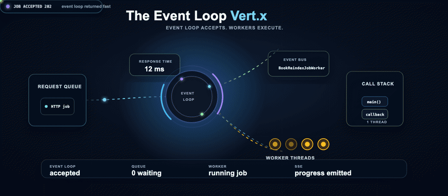
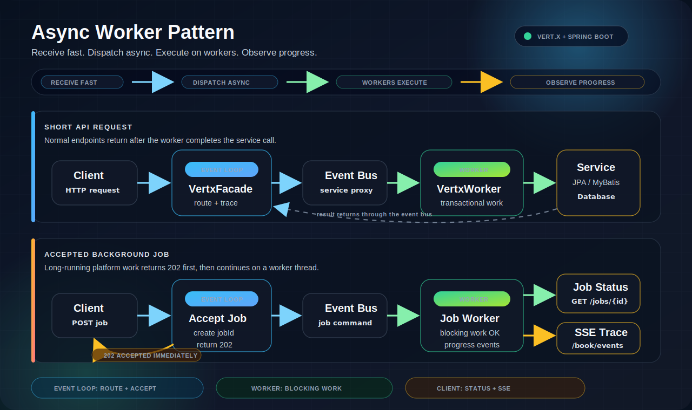

# Vert.x Embedded Spring Boot Async Worker Pattern

[](https://github.com/hyeonsangjeon/vertx-embedded-springboot/actions/workflows/ci.yml)


> Accept HTTP work on the event loop, return quickly, execute blocking platform work on worker threads, and expose progress.



This repository is a compact reference implementation of one practical boundary:

```text
HTTP event loop -> 202 Accepted -> event bus -> worker thread -> observable result
```

The concrete example rebuilds a book search index. The caller receives a job ID immediately, a worker reads the database and performs deliberately blocking index writes, and the finished index can be queried through a real endpoint. Job status and Server-Sent Events (SSE) make every handoff visible.

Modernized and polished with **OpenAI Codex** as an AI coding collaborator. See [CONTRIBUTORS.md](CONTRIBUTORS.md).

## Try It in 60 Seconds

Requirements: Java 17+ and `curl`. The included Maven Wrapper downloads Maven 3.9.11 on the first run.

Terminal 1, start the application with the in-memory H2 profile:

```bash
./mvnw spring-boot:run -P h2local
```

Terminal 2, run the complete accepted-job walkthrough:

```bash
./scripts/demo.sh
```

The script opens the SSE stream, submits a search-index rebuild, waits for the worker lifecycle, and searches the newly published index. No external database, queue, search engine, or `jq` installation is required.

On Windows, use `mvnw.cmd` instead of `./mvnw`.

You can also open [http://localhost:8989](http://localhost:8989) in a browser. The root response lists the next API calls and shows which event-loop thread served it.

If macOS still selects Java 8, switch the current shell first:

```bash
export JAVA_HOME=$(/usr/libexec/java_home -v 17)
export PATH="$JAVA_HOME/bin:$PATH"
```

## What the Demo Proves

The observed lifecycle is intentionally ordered:

```text
event-loop.received
job.accepted
event-loop.completed      <- HTTP 202 has been written
event-loop.dispatch
job.started               <- now running on vert.x-worker-thread-*
job.progress
job.completed
```

| Signal | Meaning |
|---|---|
| `HTTP/1.1 202 Accepted` | The caller is released with a job ID and `Location` header |
| `event-loop.completed` before `job.started` | Blocking work does not extend the HTTP request |
| `job.progress` on `vert.x-worker-thread-*` | Database and index writes are isolated from the event loop |
| `progressPercent` | Polling clients can render deterministic progress |
| `GET /book/search?q=...` | The background job produces an observable result |

The per-book delay configured by `demo.reindex.item-delay-ms` stands in for a blocking Elasticsearch, OpenSearch, vector-store, model-registry, or filesystem SDK call. It is deliberately placed in the worker implementation so the event loop remains responsive.

## Architecture



The application has two request shapes:

| Shape | Flow |
|---|---|
| Request/response service call | Event loop -> service proxy -> worker -> JPA/MyBatis -> event bus reply -> HTTP response |
| Accepted background job | Event loop -> HTTP 202 -> event bus command -> worker -> job status, SSE, and search index |

The worker consumers are deployed before the HTTP facade. This prevents a startup race where the server could accept traffic before an event-bus handler existed.

## Search-Index Scenario

1. `POST /book/jobs/reindex` creates an in-memory job in `ACCEPTED` state.
2. Vert.x writes `202 Accepted`, `Location: /book/jobs/{jobId}`, and `Retry-After: 1`.
3. Only after the response completes, the event loop dispatches a command over the event bus.
4. A worker verticle reads books through Spring Data JPA and builds search documents.
5. Progress is published after every document.
6. The complete immutable index snapshot is published atomically.
7. Clients poll the job, watch SSE, or query `/book/search`.

This maps directly to platform work such as dataset ingestion, feature materialization, model refresh, report generation, media conversion, or bulk synchronization.

## Manual Walkthrough

Watch lifecycle events:

```bash
curl -N http://localhost:8989/book/events
```

Submit the job from another terminal:

```bash
curl -i -X POST http://localhost:8989/book/jobs/reindex
```

The response returns immediately:

```http
HTTP/1.1 202 Accepted
Location: /book/jobs/f97f7c86-0581-47b5-bef4-1045f218bb69
Retry-After: 1
Content-Type: application/json; charset=utf-8
```

```json
{
  "statusCode": 202,
  "data": {
    "jobId": "f97f7c86-0581-47b5-bef4-1045f218bb69",
    "type": "book.search-index.rebuild",
    "status": "ACCEPTED",
    "total": 0,
    "processed": 0,
    "progressPercent": 0,
    "links": {
      "status": "/book/jobs/f97f7c86-0581-47b5-bef4-1045f218bb69",
      "events": "/book/events",
      "search": "/book/search?q=Hyeon-Sang"
    }
  },
  "message": "search index rebuild accepted"
}
```

Poll the URL from the `Location` header:

```bash
curl http://localhost:8989/book/jobs/{jobId}
```

After `status` becomes `COMPLETED`, query the produced index:

```bash
curl "http://localhost:8989/book/search?q=Hyeon-Sang"
```

Before the first rebuild, the search endpoint returns an empty index. Rebuilding replaces the entire snapshot, so readers never observe a partially rebuilt index.

## API

Vert.x serves the public API at `http://localhost:8989`.

| Method | Path | Description |
|---|---|---|
| `GET` | `/` | Discover the sample flow and useful endpoints |
| `GET` | `/book/list` | List all books through the worker service proxy |
| `GET` | `/book/id/{bookId}` | Read one book with MyBatis |
| `POST` | `/book/add` | Create a book with Spring Data JPA |
| `PUT` | `/book/update` | Update a book |
| `DELETE` | `/book/delete/{bookId}` | Delete a book |
| `GET` | `/book/events` | Stream event-loop, worker, and job phases over SSE |
| `POST` | `/book/jobs/reindex` | Accept a search-index rebuild job |
| `GET` | `/book/jobs/{jobId}` | Read job status and progress |
| `GET` | `/book/search?q={query}` | Search the index published by the job |

Create a book:

```bash
curl -X POST http://localhost:8989/book/add \
  -H "Content-Type: application/json" \
  -d '{
    "name": "Designing Event-Driven Systems",
    "author": "Example Author",
    "pages": 320
  }'
```

## Code Map

| Component | Responsibility |
|---|---|
| `Application` | Creates Vert.x and deploys workers before the HTTP facade |
| `VertxFacade` | Owns the HTTP event-loop boundary and discovery response |
| `RouteHandler` / `RequestHandler` | Validate requests, return 202, dispatch work, and format responses |
| `BookAsyncService` | Vert.x 5 Future-based service proxy contract |
| `VertxWorker` | Registers service and job consumers on the worker pool |
| `BookReindexJobWorker` | Performs the blocking search-index rebuild |
| `BookJobRegistry` | Stores accepted-job state for this self-contained sample |
| `BookSearchIndex` | Atomically publishes and queries the rebuilt index snapshot |
| `EventLoopMonitor` | Publishes request and job phases to SSE clients |

## Ports and Monitoring

| Port | Service | Useful URL |
|---|---|---|
| `8989` | Vert.x public HTTP server | `http://localhost:8989/` |
| `7979` | Spring Actuator | `http://localhost:7979/actuator/health` |
| `9000` | Spring MVC / H2 console | `http://localhost:9000/h2-console` |

```bash
curl http://localhost:7979/actuator/health
curl http://localhost:7979/actuator/info
curl http://localhost:7979/actuator/liquibase
```

Each SSE event contains `requestId`, `operation`, `step`, `thread`, and `elapsedMs`, so the handoff can be inspected without a debugger.

## Configuration

Profile-specific settings live under `src/main/resources/profiles/{profile}/`.

| Profile | Purpose |
|---|---|
| `h2local` | Zero-setup local run with an in-memory H2 database |
| `mariadb` | External MariaDB-compatible deployment example |

Important settings:

```properties
vertx.port=8989
vertx.worker.pool.size=6
vertx.springWorker.instances=4
vertx.max.eventloop.execute.time=10000
vertx.blocked.thread.check.interval=1000
demo.reindex.item-delay-ms=150
```

For MariaDB, replace the placeholders in `src/main/resources/profiles/mariadb/application.properties`, then run:

```bash
./mvnw spring-boot:run -P mariadb
```

## Development

Run the tests:

```bash
./mvnw verify -P h2local
```

Build the executable jar:

```bash
./mvnw clean package -P h2local
java -jar target/vertx-embedded-springboot-0.8.0-SNAPSHOT.jar
```

Regenerate the animated hero from its SVG source:

```bash
node scripts/render-event-loop-hero-gif.mjs
```

The GitHub social preview is available at `docs/social-preview.png`; its editable source is `docs/social-preview.svg`.

## Production Boundary

This repository keeps infrastructure in process so the asynchronous boundary is easy to study. `BookJobRegistry`, `BookSearchIndex`, and the Vert.x event bus are not durable across restarts. A production deployment should persist job state, use a durable broker when delivery guarantees matter, define idempotency and retry rules, and publish to an external search or vector store.

The pattern stays the same even when those adapters change:

```text
accept quickly -> dispatch reliably -> isolate blocking work -> expose state
```

## Stack

- Java 17
- Vert.x 5.1.5
- Spring Boot 4.1.0
- Spring Data JPA and MyBatis
- Liquibase
- H2 and MariaDB-compatible JDBC

## Contributors

Built and maintained by Hyeonsang Jeon, with OpenAI Codex acknowledged as an AI coding collaborator for the modernization pass. See [CONTRIBUTORS.md](CONTRIBUTORS.md).

## References

- [Vert.x Core Documentation](https://vertx.io/docs/vertx-core/java/)
- [Vert.x Service Proxies](https://vertx.io/docs/vertx-service-proxy/java/)
- [Vert.x 4 to 5 Migration Guide](https://vertx.io/docs/guides/vertx-5-migration-guide/)
- [Spring Boot Documentation](https://docs.spring.io/spring-boot/)

## License

Licensed under the [Apache License 2.0](LICENSE).
