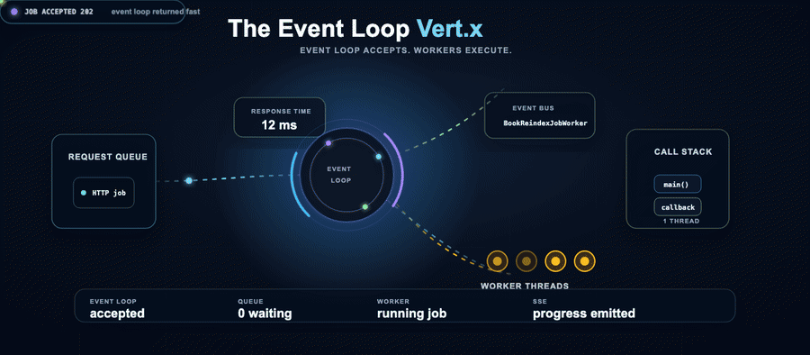

# Vert.x + Spring Boot: Event Loop and Async Worker Patterns

[](https://github.com/hyeonsangjeon/vertx-embedded-springboot/actions/workflows/ci.yml)


This self-contained, interactive reference lab shows where different kinds of work should run when Spring Boot manages the application and embedded Vert.x provides the asynchronous boundary.

It covers two service workloads without requiring an external database, broker, collector, search engine, or downstream service:

| Workload | Vert.x pattern |
|---|---|
| Several independent HTTP calls | Fan out on the event loop with `WebClient`, then combine the futures |
| JDBC or another blocking SDK | Return `202 Accepted`, confirm dispatch over the event bus, and run on a worker thread |



The sample uses a deliberately small book catalog, but the same boundaries apply to inventory aggregation, dataset ingestion, model refresh, report generation, media conversion, and bulk synchronization. It is a reference lab, not a production library, starter template, or throughput benchmark.

## Run the Whole Lab

Requirements: Java 17 or newer, `curl`, and Bash (macOS, Linux, WSL, or Git Bash).

```bash
git clone https://github.com/hyeonsangjeon/vertx-embedded-springboot.git
cd vertx-embedded-springboot
./scripts/quickstart.sh
```

The script runs the tests, builds the executable JAR, starts it with H2, checks the healthy and failed scenarios, and shuts everything down. The Maven Wrapper downloads Maven 3.9.16 on first use. On macOS, the script selects an installed Java 17 runtime when the shell still defaults to an older JDK.

No `jq` installation is required. A successful run ends with these checkpoints:

```text
[ok] Healthy fan-out returned 3 providers in <local elapsed> ms (740 ms sequential simulation).
[ok] Partial failure kept 2 responses and marked 1 provider unavailable.
job <id> -> COMPLETED
[ok] Search observed 1 indexed match(es).
job <id> -> DISPATCH_FAILED
[ok] Deterministic async boundary demo passed.
[ok] Packaged-jar smoke test passed.
```

The script checks that:

- All three provider requests arrive before the test server releases any response.
- One failed provider does not discard the two successful responses.
- The HTTP `202 Accepted` response is written before worker dispatch starts.
- The worker acknowledges receipt over the event bus before running blocking work.
- The demo polls the job to a terminal state before reading its result.
- A missing event-bus consumer becomes `DISPATCH_FAILED` instead of disappearing silently.

These checks do not measure production throughput, prove cross-process delivery, or make the in-memory job state durable. The latency values come from deterministic local test doubles. They help explain the flow but do not compare framework performance.

In Windows PowerShell, start the persistent application with `.\mvnw.cmd spring-boot:run -P h2local`, then run the documented `curl` calls directly. A native PowerShell smoke script is not included yet.

To keep the application running for exploration, use two terminals instead:

```bash
# Terminal 1
./mvnw spring-boot:run -P h2local
```

```bash
# Terminal 2
./scripts/demo.sh
```

The public API is available at [http://localhost:8989](http://localhost:8989). Its root response lists the main calls and the event-loop thread that served the request. To ensure that it tests the newly built JAR, `quickstart.sh` refuses to reuse a process already bound to that URL. Use `demo.sh` when you intend to exercise an existing process.

Set `DEMO_VERBOSE=1` to include the full JSON responses with the compact state and thread trace:

```bash
DEMO_VERBOSE=1 ./scripts/demo.sh
```

## Example 1: Concurrent HTTP Fan-Out

An availability request calls three independent inventory services over local HTTP:

```bash
curl http://localhost:8989/book/availability/1
```

`BookAvailabilityAggregator` starts all three requests before waiting for a response, then combines them with `Future.all`. The result reports the local elapsed time alongside the 740 millisecond simulated sequential sum:

```json
{
  "data": {
    "strategy": "concurrent-http-fan-out",
    "providerCount": 3,
    "partial": false,
    "simulatedSequentialLatencyMs": 740,
    "elapsedMs": 329
  }
}
```

One provider can fail without discarding successful offers:

```bash
curl "http://localhost:8989/book/availability/1?fail=busan"
```

The response remains `200 OK`, marks Busan `UNAVAILABLE`, and sets `partial` to `true`. See [Concurrent HTTP Fan-Out](docs/fanout.md) for the full response and the structural concurrency test.

## Example 2: Accepted Background Work

The second flow rebuilds an in-memory search index. The request returns before dispatch starts, then event-bus request/reply confirms that a worker received the command:

```text
HTTP event loop -> 202 Accepted -> dispatch acknowledgement -> worker thread -> observable result
```

Submit the job:

```bash
curl -i -X POST http://localhost:8989/book/jobs/reindex
```

The response includes a polling location:

```http
HTTP/1.1 202 Accepted
Location: /book/jobs/f97f7c86-0581-47b5-bef4-1045f218bb69
Retry-After: 1
Content-Type: application/json; charset=utf-8
```

Poll `Location` until `terminal` is `true`, then query the published index:

```bash
curl http://localhost:8989/book/jobs/{jobId}
curl "http://localhost:8989/book/search?q=Hyeon-Sang"
```

To reproduce a dispatch failure, send the request to an address with no consumer:

```bash
curl -X POST "http://localhost:8989/book/jobs/reindex?fail=dispatch"
```

The job reaches `DISPATCH_FAILED` instead of remaining silently accepted. [Accepted Background Job](docs/accepted-job.md) documents the response, state machine, acknowledgement, and durability limit.

## Watch the Handoffs

Open the Server-Sent Events stream before making either request:

```bash
curl -N http://localhost:8989/book/events
```

The non-blocking HTTP flow emits:

```text
event-loop.received
io.fanout.started
io.fanout.completed
event-loop.completed
```

The accepted worker flow emits events in this order:

```text
event-loop.received
job.accepted
event-loop.completed      <- the HTTP 202 response has been written
event-loop.dispatch
job.dispatching
job.dispatched            <- a worker consumer acknowledged the command
job.started               <- now running on vert.x-worker-thread-*
job.progress
job.completed
```

Each event includes a sequence number, request ID, operation, thread, and elapsed time, making event-loop ownership and worker handoff visible without a debugger.

## Architecture


Spring Boot owns lifecycle and blocking persistence adapters. Embedded Vert.x owns the public HTTP boundary, event bus, non-blocking client, workers, and SSE stream. Worker consumers deploy before the HTTP facade, so the server cannot accept traffic before its handlers exist. See [Architecture](docs/architecture.md) for request shapes, component ownership, ports, and configuration.

## API

Vert.x serves the public API at `http://localhost:8989`.

| Method | Path | Description |
|---|---|---|
| `GET` | `/` | Discover the sample flows and useful endpoints |
| `GET` | `/book/availability/{bookId}` | Query three inventory services concurrently |
| `GET` | `/book/availability/{bookId}?fail=busan` | Simulate one failed downstream call |
| `GET` | `/book/list` | List books through the worker service proxy |
| `GET` | `/book/id/{bookId}` | Read one book with MyBatis |
| `POST` | `/book/add` | Create a book with Spring Data JPA |
| `PUT` | `/book/update` | Update a book |
| `DELETE` | `/book/delete/{bookId}` | Delete a book |
| `GET` | `/book/events` | Stream event-loop, I/O, worker, and job phases over SSE |
| `POST` | `/book/jobs/reindex` | Accept a search-index rebuild job |
| `POST` | `/book/jobs/reindex?fail=dispatch` | Trigger an observable missing-consumer dispatch failure |
| `GET` | `/book/jobs/{jobId}` | Read job status and progress |
| `GET` | `/book/search?q={query}` | Search the index published by the job |

Create a book:

```bash
curl -X POST http://localhost:8989/book/add \
  -H "Content-Type: application/json" \
  -d '{
    "name": "Designing Event-Driven Systems",
    "author": "Example Author",
    "pages": 320
  }'
```

## More Documentation

| Goal | Document |
|---|---|
| Understand the concurrent I/O guarantee | [Concurrent HTTP Fan-Out](docs/fanout.md) |
| Follow accepted-job states and dispatch acknowledgement | [Accepted Background Job](docs/accepted-job.md) |
| Find components, ports, profiles, and ownership | [Architecture](docs/architecture.md) |
| Decide what must change before deployment | [Production Boundary](docs/production-boundary.md) |
| Diagnose Java, port, startup, or job problems | [Troubleshooting](docs/troubleshooting.md) |

## Development

Run the full verification suite:

```bash
./mvnw verify -P h2local
```

Run the same packaged-JAR scenario used by CI:

```bash
./scripts/packaged-jar-smoke.sh
```

Build and run the executable jar:

```bash
./mvnw clean package -P h2local
java -jar target/vertx-embedded-springboot-0.8.0-SNAPSHOT.jar
```

Regenerate the animated hero from its SVG source:

```bash
node scripts/render-event-loop-hero-gif.mjs
```

The GitHub social preview is available at `docs/social-preview.png`. Its editable source is `docs/social-preview.svg`.

## Releases

Tagged releases must use a final Maven version that matches the tag exactly. A `vX.Y.Z` tag runs the full verification suite and packaged-JAR scenario before the release workflow attaches the executable JAR, its SHA-256 checksum, and the smoke transcript. See [CHANGELOG.md](CHANGELOG.md) for release history.

## Production Boundary

The local providers, event bus, job registry, index, and H2 database are in-process fixtures. Request/reply confirms local receipt, but it does not provide durable delivery. See [Production Boundary](docs/production-boundary.md) for what needs to change before production. The placement rule remains:

```text
non-blocking I/O -> stay on the event loop and compose futures
blocking work    -> accept or proxy, then isolate it on workers
```

## Stack

- Java 17
- Vert.x 5.1.6
- Spring Boot 4.1.0
- MyBatis Spring Boot Starter 4.1.0
- Spring Data JPA and Liquibase
- H2 and MariaDB-compatible JDBC
- Maven Wrapper 3.9.16

## Contributors

Hyeonsang Jeon built and maintains this project. OpenAI Codex is credited as an AI coding collaborator on the modernization work. See [CONTRIBUTORS.md](CONTRIBUTORS.md).

Contributions are welcome. Read [CONTRIBUTING.md](CONTRIBUTING.md) for the verification contract and [SECURITY.md](SECURITY.md) for private vulnerability reporting.

## References

- [Vert.x Core Documentation](https://vertx.io/docs/vertx-core/java/)
- [Vert.x Web Client](https://vertx.io/docs/vertx-web-client/java/)
- [Vert.x Service Proxies](https://vertx.io/docs/vertx-service-proxy/java/)
- [Vert.x 4 to 5 Migration Guide](https://vertx.io/docs/guides/vertx-5-migration-guide/)
- [Spring Boot Documentation](https://docs.spring.io/spring-boot/)

## License

Licensed under the [Apache License 2.0](LICENSE).
