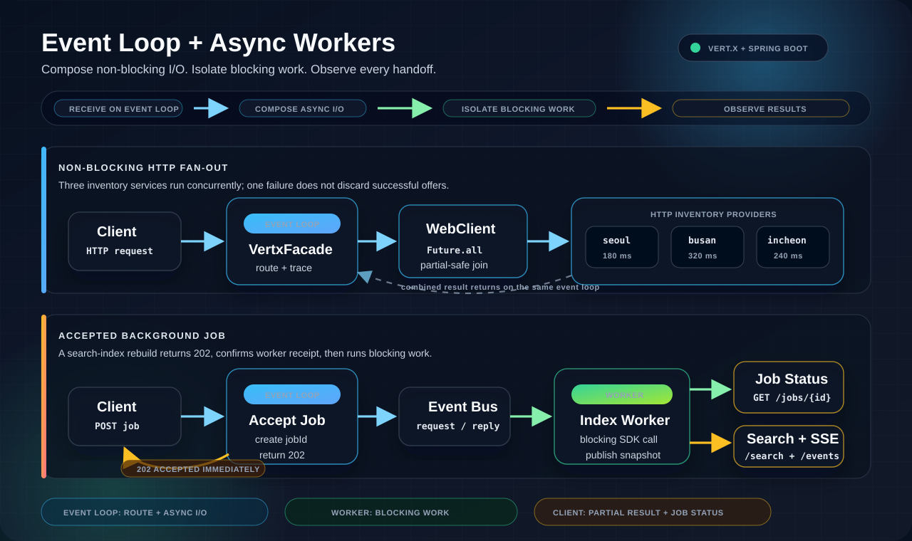

# Architecture



Spring Boot owns application lifecycle, dependency injection, Liquibase, and blocking persistence adapters. Embedded Vert.x owns the public HTTP server, non-blocking client, event bus, worker pool, and SSE stream.

Worker verticles are deployed before `VertxFacade`. If either worker consumer cannot register, startup fails before the public server can accept traffic.

## Request Shapes

| Shape | Flow |
|---|---|
| Concurrent I/O | Event loop -> `WebClient` calls -> `Future.all` -> partial-safe response |
| Proxied persistence | Event loop -> service proxy -> worker -> JPA/MyBatis -> event-bus reply -> response |
| Accepted job | Event loop -> `202` -> event-bus request/reply -> worker -> status, SSE, and search result |

## Code Map

| Component | Responsibility |
|---|---|
| `Application` | Creates Vert.x and deploys workers before the HTTP facade |
| `VertxFacade` | Owns the event-loop HTTP boundary and discovery response |
| `BookAvailabilityAggregator` | Starts concurrent HTTP calls and preserves partial results |
| `DemoInventoryProviderHandler` | Provides deterministic local downstream behavior |
| `RouteHandler` / `RequestHandler` | Validates requests, composes futures, and dispatches accepted work |
| `BookAsyncService` | Defines the Vert.x Future-based service proxy contract |
| `VertxWorker` | Registers persistence and acknowledged job consumers on worker threads |
| `BookReindexJobWorker` | Runs the blocking search-index rebuild |
| `BookJobRegistry` | Atomically admits jobs, replays retained keys, and bounds in-memory state |
| `BookSearchIndex` | Atomically publishes and queries an immutable index snapshot |
| `EventLoopMonitor` | Publishes request, I/O, dispatch, worker, and job phases over SSE |

## Ports

| Port | Owner | Useful URL |
|---|---|---|
| `8989` | Vert.x public HTTP server | `http://localhost:8989/` |
| `7979` | Spring Actuator | `http://localhost:7979/actuator/health` |
| `9000` | Spring MVC and H2 console | `http://localhost:9000/h2-console` |

Profile settings live under `src/main/resources/profiles/{profile}/`.

| Profile | Purpose |
|---|---|
| `h2local` | Zero-setup run with in-memory H2 |
| `mariadb` | External MariaDB-compatible example |

Key settings:

```properties
vertx.port=8989
vertx.worker.pool.size=6
vertx.springWorker.instances=4
vertx.max.eventloop.execute.time=10000
vertx.blocked.thread.check.interval=1000
demo.reindex.item-delay-ms=150
demo.jobs.max-active=1
demo.jobs.max-retained=256
demo.jobs.retention-seconds=900
```

The reindex delay stands in for a blocking Elasticsearch, OpenSearch, vector-store, model-registry, filesystem, or similar SDK call. It remains inside the worker implementation.

The registry holds a short lock for metadata operations only. Repository access, event-bus requests, HTTP writes, and indexing run outside that lock. Active work never expires; terminal records and their keys expire together. See [Retries and Capacity](job-admission.md) for admission and retention behavior.
